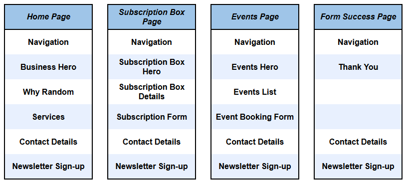

# Random Old Books

Random Old Books is a website built for a fictional retailer of the same name that sells vintage books printed more than 20 years ago.

The business has one physical bookshop, where it also holds regular events with authors (events are free, but participants often buy books while they're at the store), and it has a mail-order subscription box service where subscribers are sent one random book per month.

The company's unique selling proposition is that it believes in the positive power of random events and chance encounters, so it adds a dash of randomness to its customers' lives by placing books randomly on its bookshelves and by sending out a random book each month to subscription box subscribers.

## User Experience Design

### Site Goals (Strategy Plane)

The backstory is that the Random Old Books business is struggling to remain viable as it doesn't have enough customers and its existing customers don't make enough repeat purchases. To help fix this problem, the manager wanted a new website to be developed with the following goals:

1. Raise awareness of the business and its services (a vintage bookstore, a subscription service and regular events).
2. Maintain the company's relatively understated branding.
3. Make it easy for users to find and contact the store.
4. Inform users about upcoming events and make it easy for them to book events.
5. Inform users about the subscription box service and make it easy for them to sign up for a trial.
6. Make it easy for users to subscribe to the company's free monthly e-newsletter.

### User Personas (Strategy Plane)

There are three main user personas, one for each of the business's three main services (bookstore, subscription box, events):

**The Adventurous Browser**: Loves the thrill of browsing through stores, hoping to discover the unexpected. Often buys books from authors they've never heard of, accepting whatever fate hands them.

**The Online Surprise Seeker**: Prefers reading experiences where every month brings a surprise. Embraces the challenge of reading whatever book they get, treating it as an opportunity to experience new things.

**The Conversational Enthusiast**: Values engaging discussions more than just the books themselves. Enjoys interacting with authors and other readers, asking thought-provoking questions and participating in lively debates.

### User Stories (Scope Plane)

#### User Story 1: A professional-looking, responsive, user-friendly interface

- As an **Adventurous Browser**, I want to see a professional website that looks good on various screen sizes and is easy to navigate, so I'm not put off by a poor user experience.

#### User Story 2: Enticing images and descriptions of the business, its products and services

- As an **Adventurous Browser**, I want to learn about the business, its products and services, so I can decide if I'd like to visit the store.

#### User Story 3: Location, opening hours and contact details

- As an **Adventurous Browser**, I want to be able to easily find the store's location and opening hours, so I know where and when to visit.

#### User Story 4: Subscription box subscription form

- As an **Online Surprise Seeker**, I want to be able to easily find a subscription box sign-up form, so I can subscribe immediately.

#### User Story 5: List of events and booking form

- As a **Conversational Enthusiast**, I want to see a list of upcoming events and a booking form, so I can decide which event to attend and book my place.

#### User Story 6: E-newsletter sign-up form

- As an **Conversational Enthusiast**, I want to be able to easily subscribe to the company's free e-newsletter, so I can be kept up to date with the latest events and book my seat before they've all gone.

### Site Structure (Structure Plane)

To realise all of the user stories, the site has the following sections:

- A **Navigation** section so users can easily navigate around the site (user story 1).
- A **Homepage Hero** section with an enticing image of the store and a good elevator pitch for the business and its services (user story 2).
- A **Why Random** section that explains why users should read (and buy) random books (user story 2).
- A **Services** section with images and brief descriptions for each of the company's three services (user story 2).
- A **Subscription Box Hero** section with an enticing image and description of the subscription box service (user story 2).
- An **Events Hero** section with an enticing image and summary of the events (user story 2).
- A **Contact Details** section where users can find all relevant contact details (user story 3).
- A **Subscription Box Details** section detailing the features and benefits of the service (user story 4).
- A **Subscription Form** section that contains the sign-up form (user story 4).
- A **Thank You** section that contains a thank-you message and a homepage button (user story 4).
- An **Events List** section containing details of upcoming events (user story 5).
- An **Event Booking Form** section that contains the event booking form (user story 5).
- A **Newsletter Sign-up** section containing a description of the newsletter and a sign-up button (user story 6).

These sections were allocated to various web pages based on their importance and the intuitive flow of information that most users would expect (e.g. putting the list of events directly above the event booking form).

The resulting website structure is shown below.

### Wireframes (Skeleton Plane)

Wireframe software: [Wireframe.cc](https://www.wireframe.cc)

Click on the links below to see an image of each wireframe.

- Homepage
  - [Laptop](assets/docs/1-Home-Laptop.png)
  - [Tablet](assets/docs/2-Home-Tablet.png)
  - [Mobile](assets/docs/3-Home-Mobile.png)
- Subscription box page
  - [Laptop](assets/docs/4-Subscription-Box-Laptop.png)
  - [Tablet](assets/docs/5-Subscription-Box-Tablet.png)
  - [Mobile](assets/docs/6-Subscription-Box-Mobile.png)
- Events page
  - [Laptop](assets/docs/7-Events-Laptop.png)
  - [Tablet](assets/docs/8-Events-Tablet.png)
  - [Mobile](assets/docs/9-Events-Mobile.png)
- Form Success page
  - [Laptop](assets/docs/10-Success-Laptop.png)
  - [Tablet](assets/docs/11-Success-Tablet.png)
  - [Mobile](assets/docs/12-Success-Mobile.png)

### Colour Palette, Fonts, Images and Content (Surface Plane)

#### Colour palette

The site uses the following "vintage" colours, which suit the company's position as a seller of old books:

- #567a79 (a dark green) as the primary background colour
- #504746 (a dark brown) as the second background colour
- #FFFFFF (white) as the light text colour on dark backgrounds

#### Custom fonts

THe site uses two custom fonts from [Google Fonts](https://fonts.google.com/):

- Headings: [Limelight](https://fonts.google.com/specimen/Limelight) (a vintage font that contrasts strongly with the body font)
- Body text: [Quicksand](https://fonts.google.com/specimen/Quicksand) (a clean san serif font that should be easy to read on screens)

#### Images

**TODO: Images are still being added, but so far they're all from https://unsplash.com/**

## Features

### Existing Features

#### Navigation bar

**TODO: Add an image when all nav links are in place**

#### Homepage Hero section

- The homepage includes an above-the-fold section with an enticing image from inside the store and an elevator pitch for the idea of reading reading random old books. 
- This supports the implementation of user story 2 and is useful to users as it helps them understand what the site is about as well as why they should continue scrolling down the page.

#### Homepage Why Random section

- The homepage includes a section with an engaging and emotive explanation of why the user should read random old books (preferably purchased from the Random Old Books website).
- This supports the implementation of user story 2 and is useful to users because it gives them a deeper understanding of the value of reading random old books.

#### Homepage Services section

- The homepage includes a section with enticing images and descriptions of the business's three core services. 
- This supports the implementation of user story 2 and is useful to users because it helps them understand the valuable services offered by the business.

TODO: Add an image here when the Services section is complete

#### Subscription Box Hero section

#### Subscription Box Details section

#### Subscription Form section

#### Events Hero section

#### Events List section

#### Event Booking Form section

#### Contact Details section

#### Newsletter Sign-up section

### Features Left to Implement

## Testing 

TODO: Add aria accessibility testing

### Validator Testing 

#### HTML Validation

#### CSS Validation

#### Contrast Checker

Initially the light text colour was cream, but the contrast was too low to pass the Contrast Checker's tests, so I switched it to pure white.

### Unfixed Bugs

## Deployment

The site has been deployed to GitHub Pages using the following procedure:

1. In the GitHub repository, navigate to Settings / Pages
2. Under the Build and deployment heading, select the Main branch and click Save
3. Wait a few minutes for the site to be deployed (refresh the page to check)

The live link can be found here:

- https://john-kingham.github.io/random-old-books/

## Credits 

### Content 

- README.md
  - I used [Code Institute's README.md template](https://github.com/Code-Institute-Solutions/readme-template/blob/master/README.md) as the starting point for this document.
  - I referenced Code Institute's *Creating a README* slide deck.
  - I used https://ui.dev/amiresponsive to generate the multi-screen image shown at the start of the README.
- User Experience Design
  - I read [The Elements of User Experience](http://www.jjg.net/elements/) and used it to guide me through the user experience design phase.
- User Personas
  - I used Microsoft Co-Pilot to help me develop the user personas.
- Colour Palette
  - The colour scheme was inspired by the colours on this webpage: https://craigandrose.com/collections/vintage-styles-art-deco. I used https://imagecolorpicker.com/ to extract hex colours from a screenshot of that page.
- Favicon
  - I used https://gauger.io/fonticon/ to create a favicon image from an icon.
  - I used https://favicon.io/ to convert the favicon into multiple favicon formats.
  - I converted hex colours to RGB using https://www.rgbtohex.net/hex-to-rgb/.
- Fonts
  - I used fonts from Google Fonts: https://fonts.google.com/
- Icons
  - I used Font Awesome for icons: https://fontawesome.com/
  - I learned how to use Font Awesome icons in unordered lists from: https://docs.fontawesome.com/web/style/lists  
- HTML and CSS
  - I used Bootstrap to simplify the implementation process: https://getbootstrap.com/
  - I learned about CSS box shadows at: https://www.w3schools.com/css/css3_shadows_box.asp 

### Media

- Images were downloaded from https://unsplash.com/, which offers free images that can be used for private or commercial purposes without attribution.

