# Random Old Books

Random Old Books is a website built for a fictional retailer of the same name that sells vintage books printed more than 20 years ago.

The business has one physical bookshop, where it also holds regular events with authors (events are free, but participants often buy books while they're at the store), and it has a mail-order subscription box service where subscribers are sent one random book per month.

The company's unique selling proposition is that it believes in the positive power of random events and chance encounters, so it adds a dash of randomness to its customers' lives by placing books randomly on its bookshelves and by sending out a random book each month to subscription box subscribers.

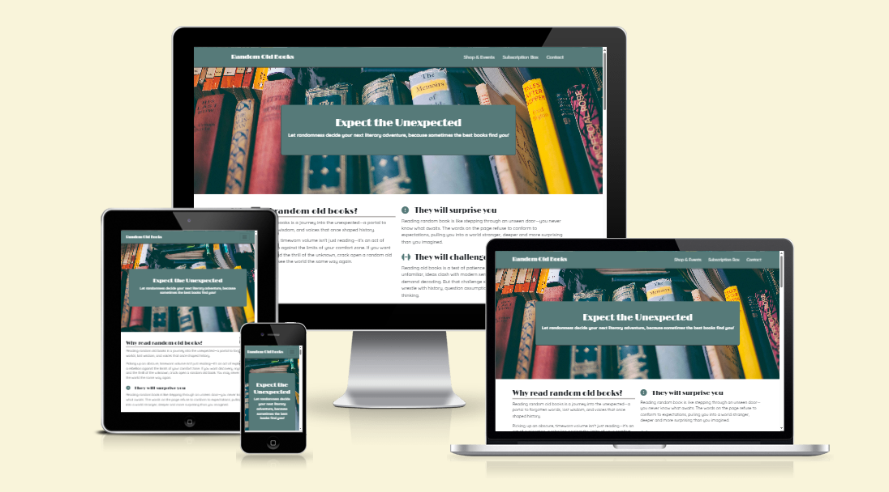

## User experience design

### Site goals (strategy plane)

The backstory is that the Random Old Books business is struggling to remain viable as it doesn't have enough customers and its existing customers don't make enough repeat purchases. To help fix this problem, the manager wanted a new website to be developed with the following goals:

- Raise awareness of the business and its services (a vintage bookstore, a subscription box service and regular events).
- Maintain the company's relatively understated branding.
- Make it easy for users to find and contact the store.
- Inform users about upcoming events and make it easy for them to book events.
- Tell users about the subscription box service and make it easy for them to sign up for more information.
- Make it easy for users to subscribe to the company's free monthly e-newsletter.

### User stories (scope plane)

1. As a user, I want to see a professional website that looks good on various screen sizes and is easy to navigate, so I'm not put off by a poor user experience.
2. As a user, I want to learn about the business, its products and services, so I can decide if this is a business I'd like to buy from.
3. As a user, I want to be able to easily find the store's location and opening hours, so I know where and when to visit.
4. As a user, I want to be able to easily find a subscription box form, so I can sign up for more information.
5. As a user, I want to see a list of upcoming events and a booking form, so I can decide which events to attend and book my place.
6. As a user, I want to be able to easily subscribe to the company's free e-newsletter, so I can be kept up to date with the latest news and events.

### Site structure (structure plane)

To fulfil all of the user stories, the site's original design had the following sections:

- **Navigation** section so users can easily navigate around the site.
- **Business Hero** section with an enticing image of the store and a good elevator pitch for the business and its services.
- **Why Random** section that explains why users should read (and buy) random books.
- **Services** section with images and brief descriptions for each of the company's three services.
- **Subscription Box Hero** section with an enticing image and description of the subscription box service.
- **Subscription Box Details** section detailing the features and benefits of the service.
- **Subscription Form** section that contains the subscription box form.
- **Events Hero** section with an enticing image and summary of the events.
- **Events List** section containing details of upcoming events.
- **Event Booking Form** section that contains the event booking form.
- **Contact Details** section where users can find all relevant contact details.
- **Thank You** section that contains a thank-you message and a homepage button.
- **Newsletter Sign-up** section containing a description of the newsletter and a sign-up form.

These sections were allocated across four pages based on their importance and the intuitive flow of information that most users would expect (e.g. putting the list of events directly above the event booking form).

The resulting structure is shown below.

#### Structure changes after initial user testing

During initial user testing of the first version of the site, there was strong feedback from users that given the limited amount of functionality and content on the site, it would be better to have most of the site on a single page. It was also decided that the user story for the e-newsletter sign-up form would not be included in the initial release.

Based on this feedback, the site's structure and sections were reorganised to fit on one page, as shown below.

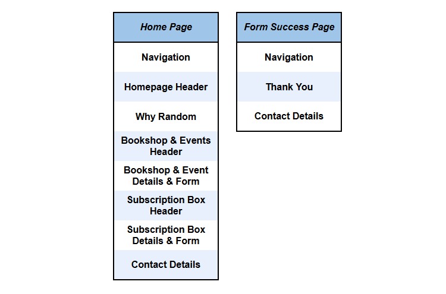

### Wireframes (skeleton plane)

Wireframes were developed for the initial multi-page structure to add further detail before moving to the surface design and implementation phases. 

When the site moved from a multi-page structure to a single-page structure, it was mostly a case of copying and pasting existing HTML, so the wireframes were not updated. Because of that, the wireframes shown below reflect the initial multi-page design, rather than the final one-page design.

#### Homepage - laptop
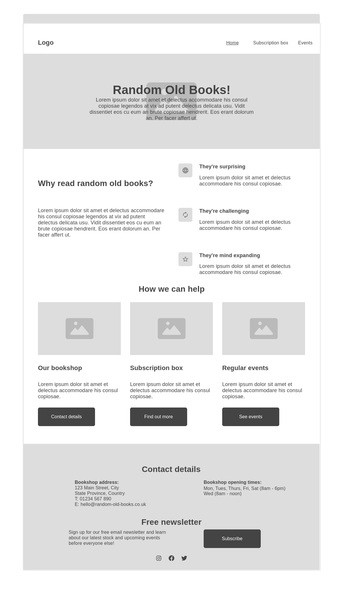
#### Homepage - tablet
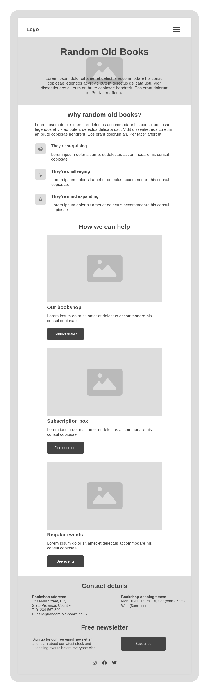
#### Homepage - mobile
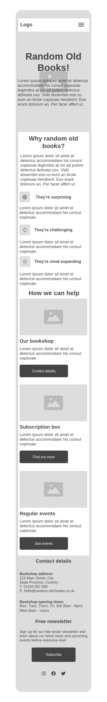
####  Subscription box page - laptop
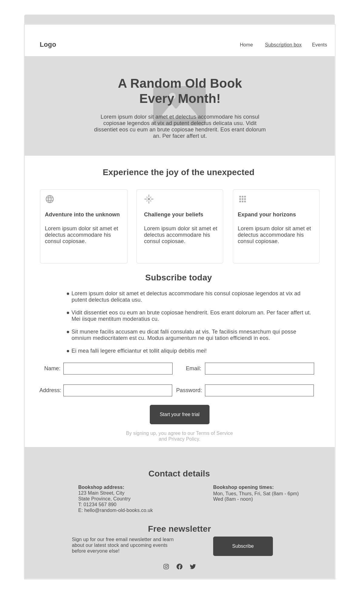
####  Subscription box page - tablet
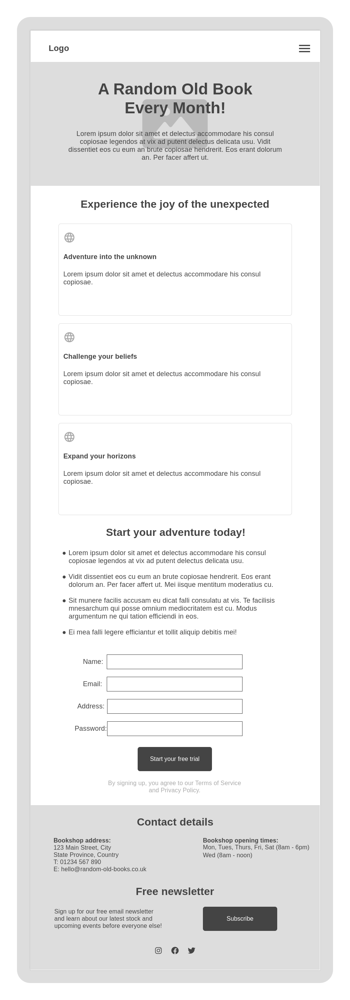
####  Subscription box page - mobile
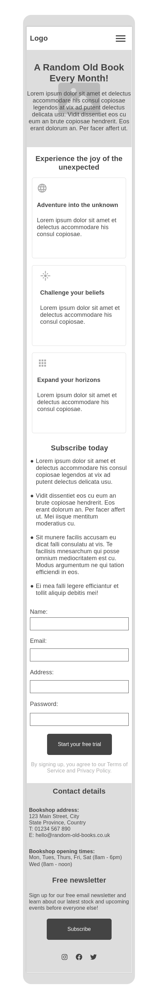
####  Events page - laptop
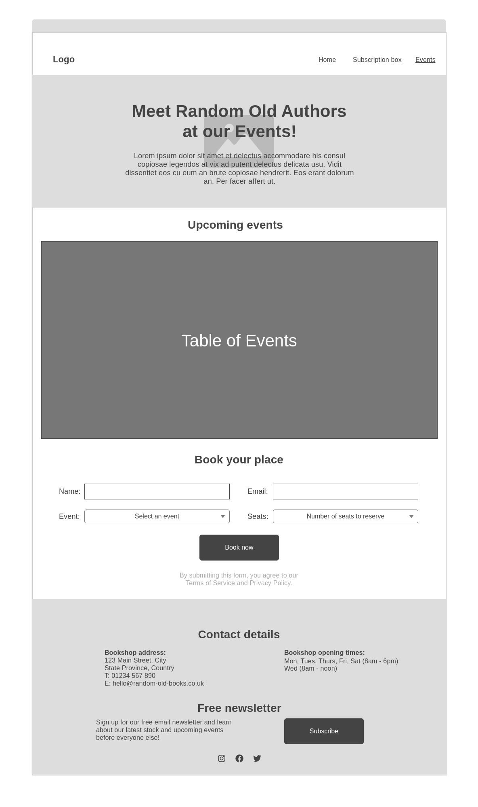
####  Events page - tablet
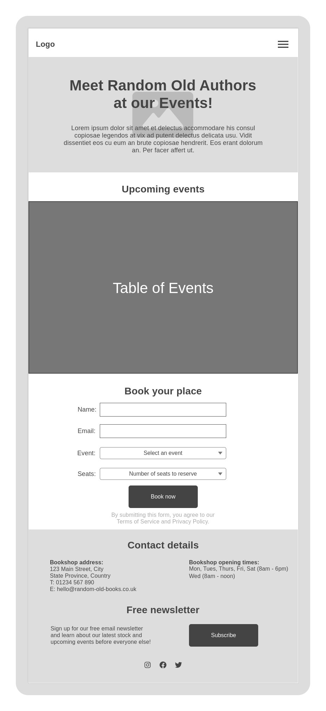
####  Events page - mobile
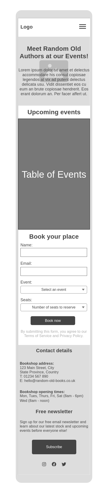
####  Form success page - laptop
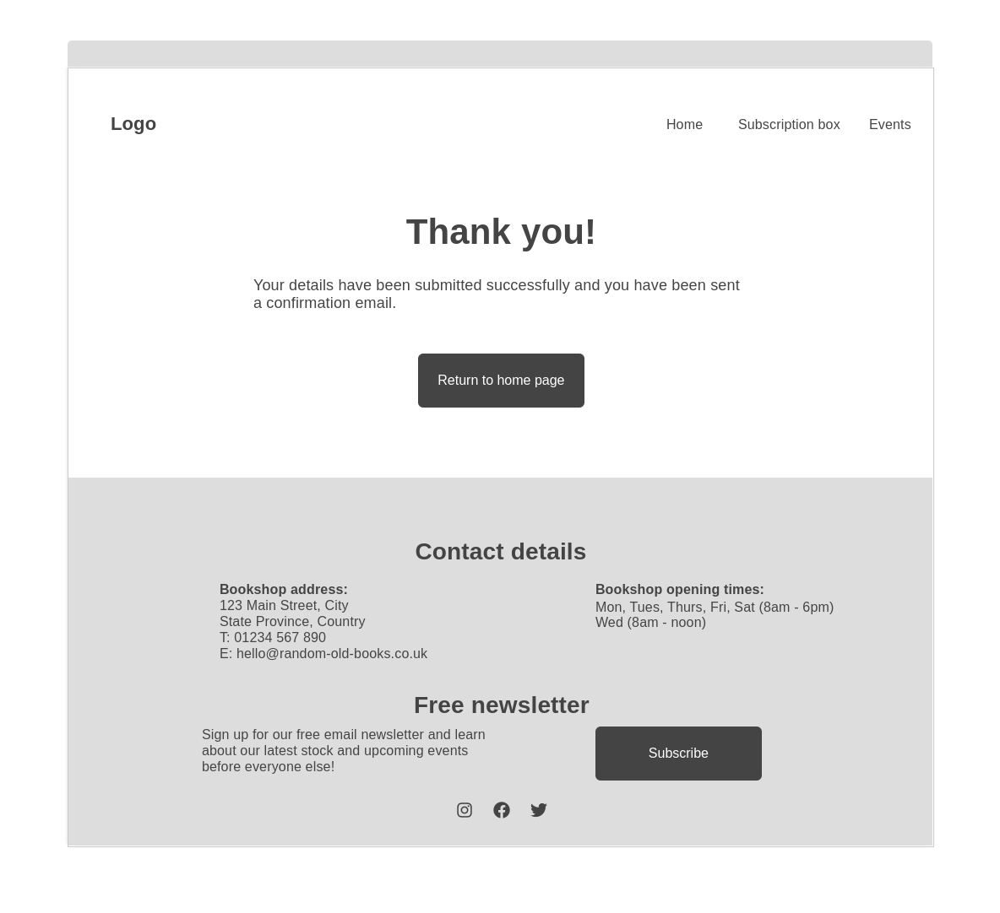
####  Form success page - tablet
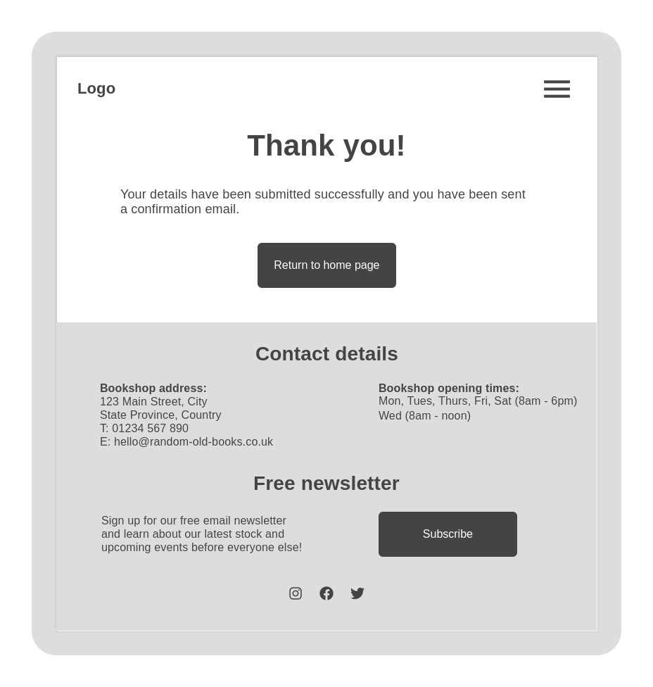
####  Form success page - mobile
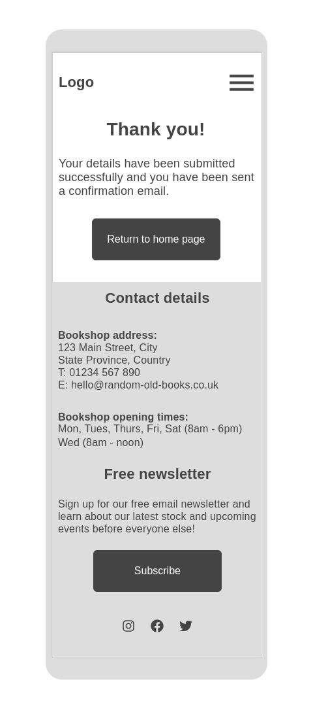

### Colour palette, fonts, images and content (surface plane)

#### Colour palette

The site uses vintage-style colours, which suit the company's position as a seller of old books:

- #567a79 (a shade of green) is the primary colour
- #504746 (a shade of brown) is the secondary colour
- #FFFFFF (white) is the contrast colour for text on dark backgrounds

These colours are shown more clearly in the Features section below.

#### Custom fonts

The site uses two custom fonts from [Google Fonts](https://fonts.google.com/):

- For headings: [Limelight](https://fonts.google.com/specimen/Limelight) (a vintage-style font that contrasts strongly with the body font)
- For body text: [Quicksand](https://fonts.google.com/specimen/Quicksand) (a san serif font that is easy to read on screens)

#### Images

Images were chosen to fit in with the site's colour palette and to fulfil the user stories (for example, an image of someone speaking at an event to highlight the events service).

You can see all of the site's images in the Features section below.

#### Content

As Random Old Books is a fictional business, I asked Microsoft Co-Pilot to come up with good copy for the site that would attract, engage and convert potential customers.

## Features

All of the descriptions and images below relate to the site's final one-page design.

### Existing Features

#### Navigation

- The site contains a navigation bar (navbar) at the top.
- The navbar includes a logo that links to the top of the homepage.
- The navbar also contains links to the site's other sections: Shop & Events and Subscription Box.
- The logo uses the heading font (Limelight) and the other links use the body font (Quicksand).
- The navbar's background is the same green as used throughout the site, as this helps to give the site a consistent look and feel.
- Text is in white, as this provides a sufficient degree of contrast.
- This section is useful to users as it shows them what they'll find on the site and gives them an easy way to navigate around the site (user story 1).

#### Homepage Header section

- This section shows a large image of some random old books, along with a heading and elevator pitch promoting the idea of reading random old books.
- The text in this section is shown against a background that uses the site's primary green colour. Text is in white to provide a clear contrast.
- This section is useful to users because it helps them understand the adventurous nature of reading random old books, and helps them further understand what the site is about (user stories 1 and 2).

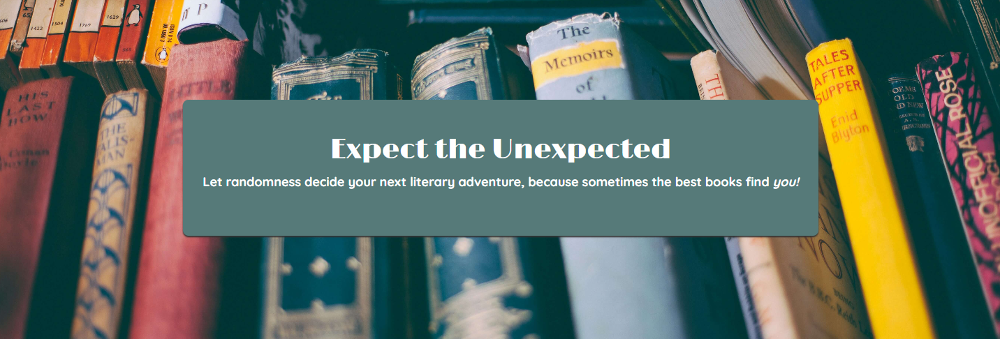

#### Why Random section

- This section contains an engaging and emotive explanation of why the user should read random old books.
- The text is broken down into an overall summary of the benefits of reading random old books, followed by three sub-points that cover specific aspects in more detail.
- Each of the three sub-points has a heading and a relevant icon.
- The background in this section is white, so text is in black to provide a high degree of contrast.
- This section is useful to users because it gives them a deeper understanding of the benefits of reading random old books (user story 2).

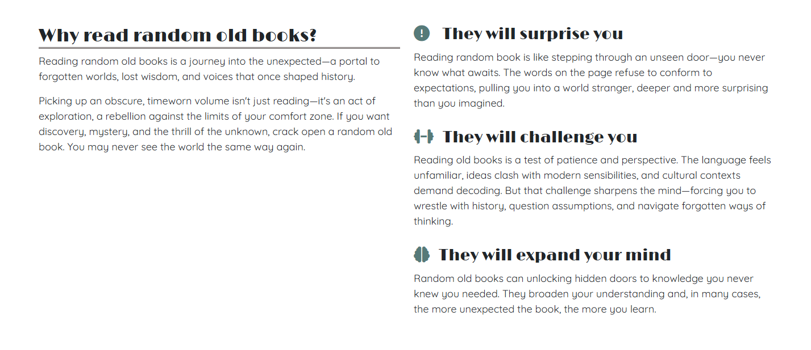

#### Bookshop and Events Header section

- This section uses the same styling as the Homepage Header section, with a relevant background image and white text over a green background.
- As part of the move to a one-page design, this section now mentions the company's bookshop as well as the events held in the bookshop.
- This section is useful to users because it separates the Why Random section from the Bookshop and Events section, and it helps users understand that the business has a bookshop and that the bookshop holds regular events (user stories 1 and 2).

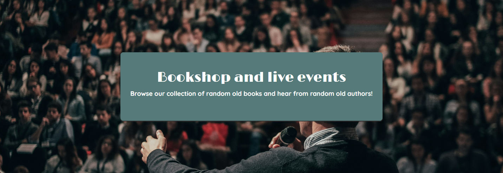

#### Bookshop and Events Details and Form section

- This section contains a description of the type of events held and a table of upcoming events.
- As part of the move to a one-page site, this section also includes details about the bookshop with a link to the Contact Details section.
- The events table has a visible border and alternate row colouring to help it stand out on the page.
- The table includes the speaking author's name, their most famous book and the event date.
- This section includes a button which opens the event booking from, which is described in more detail in the segment below.
- This section is useful to users because it gives them a more detailed understanding of the bookshop and the events, and it shows them a list of upcoming events that they can book (user stories 2 and 5).

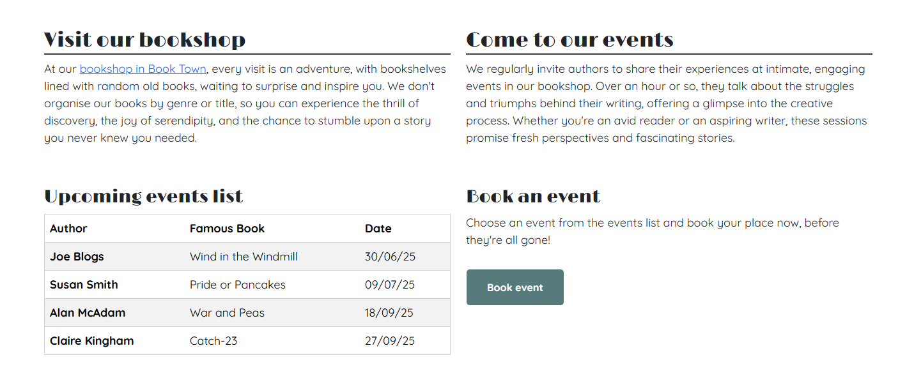

#### Event Booking Form

- The site contains a form so users can book events online.
- The form was originally implemented as an in-line form on the Events page, but when the site moved to a one-page design the form was changed to a modal form to give the homepage a cleaner appearance.
- The form includes fields for name, email address, event and number of seats. Each field has relevant validation.
- The form includes a button that matches the button style used across the site.
- When the form is submitted, the user is sent to the Form Success page.
- This form is useful to users because it enables them to book events online (user story 5).

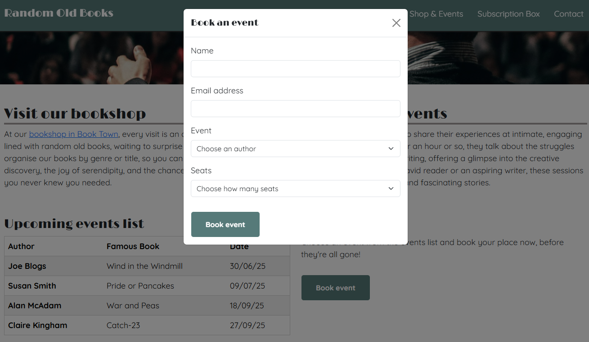

#### Subscription Box Header section

- This section introduces the subscription box service with an enticing image and description.
- The text in this section uses the same style as the other header sections, with white text on a green background.
- This section is useful to users because it separates the Bookshop and Events section from the Subscription Box section and it helps users begin to understand the subscription box service (user stories 1 and 2).

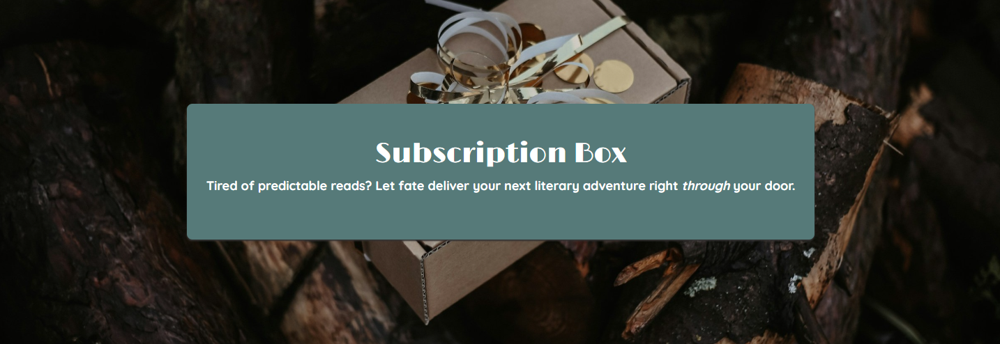

#### Subscription Box Details & Form section

- This section includes a description of the subscription box's features and benefits.
- The section includes three cards, each with an icon, heading and descriptive paragraph, which explain the main benefits of the service.
- Below the cards is a list of features that are relevant to prospective subscribers.
- This section also includes a form where users can request more information about the service. This form is described in more detail in the segment below.
- This section has a white background, so the text is black to provide a high degree of contrast.
- This section is useful to users because it gives them a detailed understanding of the subscription box service (user story 2).

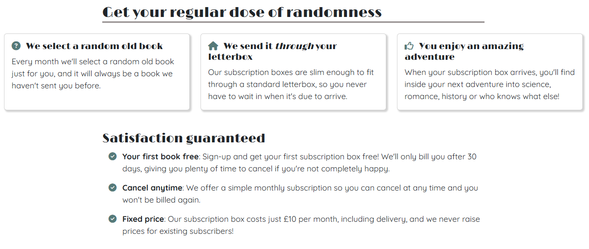

#### Subscription Box Form

- This form allows users to request an e-brochure with a more detailed explanation of the subscription box service.
- The original implementation included a full sign-up form with delivery address fields. In the final implementation, this was scaled back to focus on gathering email leads, so the final form is simpler and only includes name and email fields.
- The form has relevant validation for each field.
- The form has a subscription button that is consistent in terms of style with other buttons on the site (green background, white text, with a slight change of colour on hover).
- When submitted, the user is taken to the Form Success page.
- This section is useful to users because it allows them to request a glossy e-brochure that contains more details about the subscription box service (user story 4).

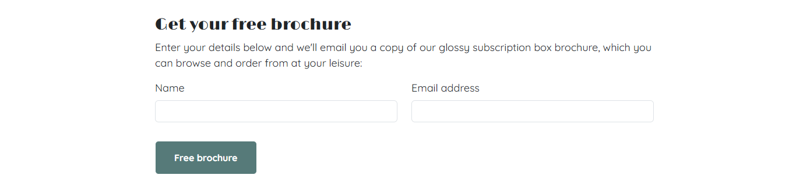

#### Contact Details section (within the footer)

- The footer contains the Contact Details section. The first implementation of the site included an e-newsletter sign-up section within the footer, but this was removed to simplify the site when it moved to a one-page design.
- The footer uses the site's secondary brown colour for its background, to differentiate it from the header and main sections of the page. Text is in white to provide sufficient contrast.
- The Contact Details section is useful because it shows users the store's address, opening hours, phone number, email and social media links (user story 3).

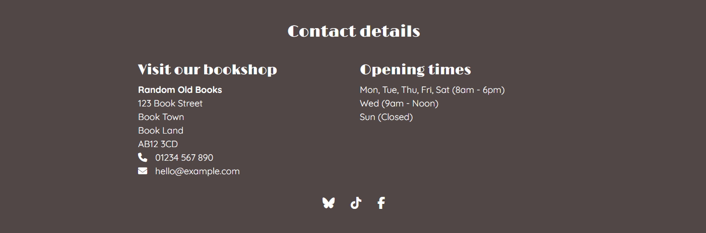

#### Form Success Thank You section

- The Form Success page contains a simple thank-you heading and message, along with a button directing the user back to the homepage.
- The section has no background image so the user is motivated to explore the more interesting parts of the site, and the button uses the standard button styling used across the site.
- This section is useful to users because it gives them feedback on the status of their form submission, and gives them an easy way to navigate back to the homepage (user story 1).

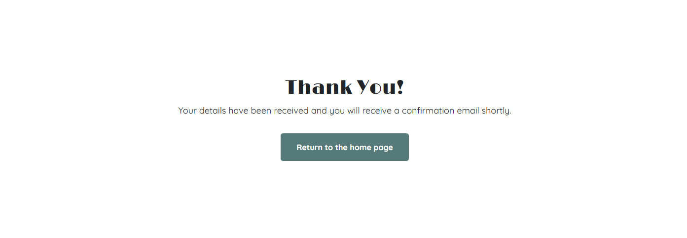

#### 404 Error page

- Based on user feedback, I added a bespoke 404 error page (this was added towards the end of the project, which is why it isn't included in the structure diagram or wireframes).
- The page is based on the Form Success page and has essentially the same format, with a simple message explaining that the page wasn't found, along with a button to take the user back to the homepage.
This page is useful to users as it gives them a 404 error page that is visually consistent with the rest of the site and an easy way to navigation back to the homepage (user story 1).

### Future Features

#### Subscription box e-commerce form
The site's original design included a form to allow users to sign up for the subscription box service, but this was dropped in favour of a simpler form to request an e-brochure by email. In the future, it would be good to add full e-commerce capabilities to the site to allow users to sign up and pay for a monthly subscription box.

#### Newsletter sign-up form
The original design included an e-newsletter sign-up form in the footer so visitors could be get regular updates by email (user story 6). This was eventually dropped from the current release, but it would still be a good feature to add in the future.

## Testing

The site was thoroughly tested, with all tests documented in [testing.md](testing.md).

## Deployment

Random Old Books has been deployed via GitHub pages.

- In the [GitHub repository](https://github.com/John-Kingham/random-old-books), navigate to the "Settings" tab.
- In Settings, click on the "Pages" link from the menu on the left.
- From the "Build and deployment" section, click the drop-down called "Branch", and select the **main** branch, then click "Save".
- The page will be automatically refreshed with a message display to indicate the successful deployment.
- Allow up to 5 minutes for the site to fully deploy.

The live link can be found on the [Random Old Books GitHub Page](https://john-kingham.github.io/random-old-books).

### Local Development

This project can be cloned or forked to make a local copy on your own system.

#### Cloning

You can clone the repository using these steps:

1. Go to the [GitHub repository](https://github.com/John-Kingham/random-old-books).
2. Click on the green "Code" button at the very top, above the commits and files.
3. Select whether you prefer to clone using "HTTPS", "SSH", or "GitHub CLI", and click the "copy" button to copy the URL to your clipboard.
4. Within your IDE, open "Git Bash" or "Terminal".
5. Change the current working directory to the location where you want the cloned directory.
6. In your IDE Terminal, type the following command to clone the repository:
	- `git clone https://github.com/John-Kingham/random-old-books.git`
7. Press "Enter" to create your local clone.

Alternatively, if using Gitpod, you can click below to create your own workspace using this repository.

**Please Note**: in order to directly open the project in Gitpod, you should have the browser extension installed. A tutorial on how to do that can be found [here](https://www.gitpod.io/docs/configure/user-settings/browser-extension).

#### Forking

By forking the GitHub Repository, you make a copy of the original repository on your GitHub account to view and/or make changes without affecting the original owner's repository. You can fork this repository by using the following steps:

1. Log in to GitHub and locate the [GitHub Repository](https://github.com/John-Kingham/random-old-books).
2. At the top of the Repository, just below the "Settings" button on the menu, locate and click the "Fork" Button.
3. Once clicked, you should now have a copy of the original repository in your own GitHub account.

### Local VS Deployment

There are no remaining major differences between the local version when compared to the deployed version online.

## Credits 

### Content 

#### README.md

- I used [Code Institute's README.md template](https://github.com/Code-Institute-Solutions/readme-template/blob/master/README.md) as the starting point for this document.
- I also referenced Code Institute's *Creating a README* slide deck.
- I used [Am I Responsive](https://ui.dev/amiresponsive) to generate the multi-screen image shown at the start of the README.
- My mentor provided a template for the Deployment section.

#### User Experience Design

  - I read ([The Elements of User Experience](http://www.jjg.net/elements/)) and used it to guide me through the user experience design process.

#### Wireframes

  - I built the wireframes using [Wireframe.cc](https://www.wireframe.cc).

#### Colour Palette

  - The colour scheme was inspired by a collection of vintage colours on the [Craig and Rose](https://craigandrose.com/collections/vintage-styles-art-deco) webpage. 
  - I used [ImageColorPicker.com](https://imagecolorpicker.com/) to extract hex colours from a screenshot of that page.

#### Favicons

  - I used [Gauger.io](https://gauger.io/fonticon/) to create a favicon image from an icon.
  - I used [Favicon.io](https://favicon.io/) to convert the favicon into multiple favicon formats.
  - I converted hex colours to RGB using [RGBtoHex.net](https://www.rgbtohex.net/hex-to-rgb/).

#### Fonts

  - I used fonts from [Google Fonts](https://fonts.google.com/).

#### Icons

  - I used [Font Awesome](https://fontawesome.com/) for icons.
  - I learned how to use Font Awesome icons in unordered lists from the [Font Awesome Docs](https://docs.fontawesome.com/web/style/lists).  

#### HTML and CSS

  - I used [Bootstrap](https://getbootstrap.com/) to simplify the implementation process.
  - I learned about CSS box shadows from [W3Schools](https://www.w3schools.com/css/css3_shadows_box.asp).
  - I used the [Mozilla Developer Network](https://developer.mozilla.org/) for general reference. 

#### JavaScript

  - I used JavaScript to make the Bootstrap mobile navbar collapse when navigating to in-page links. I copied this code from Code Institute's Boardwalk Games project.
  - My mentor told me to include `/* jshint esversion: 11 */` in JS files to help with JS validation.

#### Text

  - I used Microsoft Co-Pilot to help me generate some of the site's text.

### Media

#### Images

Images were downloaded from [UnSplash](https://unsplash.com/), which offers free images for private or commercial use without attribution. Here are the direct links to each image's Unsplash page:

- [Homepage header image](https://unsplash.com/photos/assorted-book-lot-x7CDil50KKY)
- [Bookshop and events header image](https://unsplash.com/photos/man-speaking-in-front-of-crowd-RfiBK6Y_upQ)
- [Subscription box header image](https://unsplash.com/photos/a-wrapped-present-box-sitting-on-top-of-a-pile-of-logs-nMpMO6_0VPg)

I used [Tinify](https://tinypng.com/) to reduce the size of several large images in order to improve loading times.

### People

I would like to thank my mentors, Simen and Tim, who were both extremely helpful.