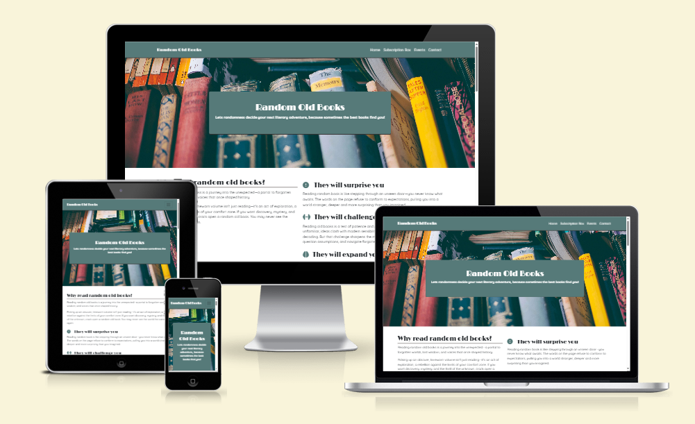
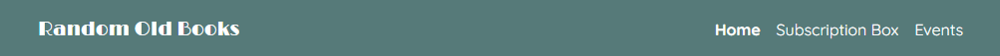
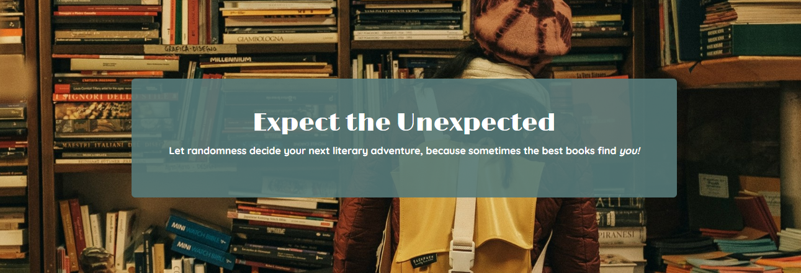
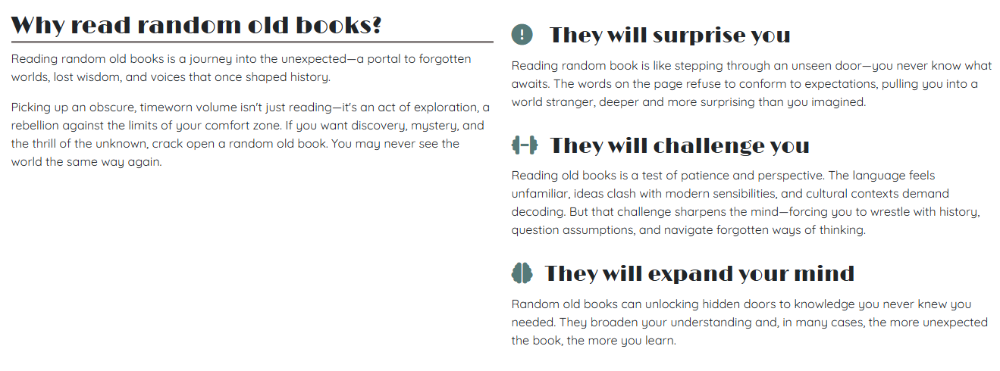
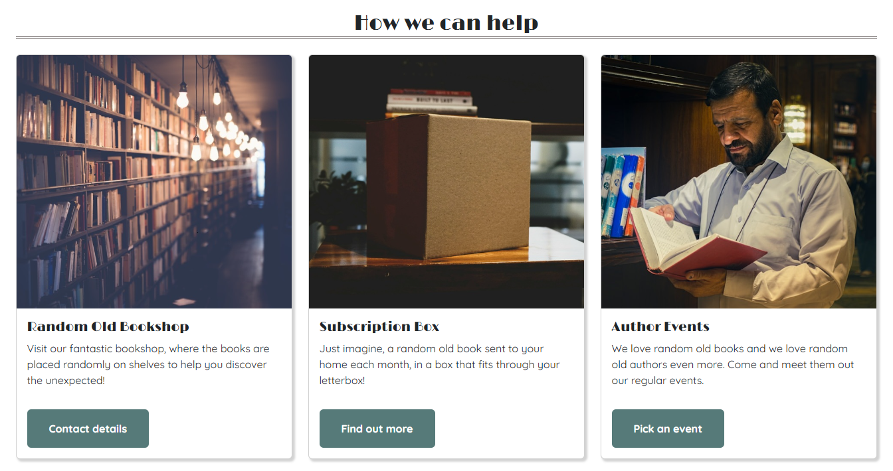

# Random Old Books

Random Old Books is a website built for a fictional retailer of the same name that sells vintage books printed more than 20 years ago.

The business has one physical bookshop, where it also holds regular events with authors (events are free, but participants often buy books while they're at the store), and it has a mail-order subscription box service where subscribers are sent one random book per month.

The company's unique selling proposition is that it believes in the positive power of random events and chance encounters, so it adds a dash of randomness to its customers' lives by placing books randomly on its bookshelves and by sending out a random book each month to subscription box subscribers.

## User Experience Design

### Site Goals (Strategy Plane)

The backstory is that the Random Old Books business is struggling to remain viable as it doesn't have enough customers and its existing customers don't make enough repeat purchases. To help fix this problem, the manager wanted a new website to be developed with the following goals:

1. Raise awareness of the business and its services (a vintage bookstore, a subscription service and regular events).
2. Maintain the company's relatively understated branding.
3. Make it easy for users to find and contact the store.
4. Inform users about upcoming events and make it easy for them to book events.
5. Inform users about the subscription box service and make it easy for them to sign up for a trial.
6. Make it easy for users to subscribe to the company's free monthly e-newsletter.

### User Personas (Strategy Plane)

There are three main user personas, one for each of the business's three main services (bookstore, subscription box, events):

**The Adventurous Browser**: Loves the thrill of browsing through stores, hoping to discover the unexpected. Often buys books from authors they've never heard of, accepting whatever fate hands them.

**The Online Surprise Seeker**: Prefers reading experiences where every month brings a surprise. Embraces the challenge of reading whatever book they get, treating it as an opportunity to experience new things.

**The Conversational Enthusiast**: Values engaging discussions more than just the books themselves. Enjoys interacting with authors and other readers, asking thought-provoking questions and participating in lively debates.

### User Stories (Scope Plane)

#### User Story 1: A professional-looking, responsive, user-friendly interface

- As an **Adventurous Browser**, I want to see a professional website that looks good on various screen sizes and is easy to navigate, so I'm not put off by a poor user experience.

#### User Story 2: Enticing images and descriptions of the business, its products and services

- As an **Adventurous Browser**, I want to learn about the business, its products and services, so I can decide if I'd like to visit the store.

#### User Story 3: Location, opening hours and contact details

- As an **Adventurous Browser**, I want to be able to easily find the store's location and opening hours, so I know where and when to visit.

#### User Story 4: Subscription box subscription form

- As an **Online Surprise Seeker**, I want to be able to easily find a subscription box sign-up form, so I can subscribe immediately.

#### User Story 5: List of events and booking form

- As a **Conversational Enthusiast**, I want to see a list of upcoming events and a booking form, so I can decide which event to attend and book my place.

#### User Story 6: E-newsletter sign-up form

- As an **Conversational Enthusiast**, I want to be able to easily subscribe to the company's free e-newsletter, so I can be kept up to date with the latest events and book my seat before they've all gone.

### Site Structure (Structure Plane)

To realise all of the user stories, the site has the following sections:

- A **Navigation** section so users can easily navigate around the site (user story 1).
- A **Homepage Hero** section with an enticing image of the store and a good elevator pitch for the business and its services (user story 2).
- A **Why Random** section that explains why users should read (and buy) random books (user story 2).
- A **Services** section with images and brief descriptions for each of the company's three services (user story 2).
- A **Subscription Box Hero** section with an enticing image and description of the subscription box service (user story 2).
- An **Events Hero** section with an enticing image and summary of the events (user story 2).
- A **Contact Details** section where users can find all relevant contact details (user story 3).
- A **Subscription Box Details** section detailing the features and benefits of the service (user story 4).
- A **Subscription Form** section that contains the sign-up form (user story 4).
- A **Thank You** section that contains a thank-you message and a homepage button (user story 4).
- An **Events List** section containing details of upcoming events (user story 5).
- An **Event Booking Form** section that contains the event booking form (user story 5).
- A **Newsletter Sign-up** section containing a description of the newsletter and a sign-up form (user story 6).

These sections were allocated across four pages based on their importance and the intuitive flow of information that most users would expect (e.g. putting the list of events directly above the event booking form).

The resulting structure is shown below.

### Wireframes (Skeleton Plane)

Wireframes were developed for each page to add further detail before moving to the surface design and implementation phases.

Click on the links below to see an image of each wireframe.

- Homepage
  - [Laptop](docs/home-laptop-wireframe.png)
  - [Tablet](docs/home-tablet-wireframe.png)
  - [Mobile](docs/home-mobile-wireframe.png)
- Subscription box page
  - [Laptop](docs/subscription-box-laptop-wireframe.png)
  - [Tablet](docs/subscription-box-tablet-wireframe.png)
  - [Mobile](docs/subscription-box-mobile-wireframe.png)
- Events page
  - [Laptop](docs/events-laptop-wireframe.png)
  - [Tablet](docs/events-tablet-wireframe.png)
  - [Mobile](docs/events-mobile-wireframe.png)
- Form Success page
  - [Laptop](docs/success-laptop-wireframe.png)
  - [Tablet](docs/success-tablet-wireframe.png)
  - [Mobile](docs/success-mobile-wireframe.png)

### Colour Palette, Fonts, Images and Content (Surface Plane)

#### Colour palette

The site uses the following vintage-style colours, which suit the company's position as a seller of old books:

- #567a79 (a dark green) as the primary background colour
- #504746 (a dark brown) as the second background colour
- #FFFFFF (white) as the contrast colour for text on dark backgrounds

These colours are shown more clearly in the Features section below.

#### Custom fonts

The site uses two custom fonts from [Google Fonts](https://fonts.google.com/):

- For headings: [Limelight](https://fonts.google.com/specimen/Limelight) (a vintage-style font that contrasts strongly with the body font)
- For body text: [Quicksand](https://fonts.google.com/specimen/Quicksand) (a san serif font that is easy to read on screens)

#### Images

Images were chosen to fit in with the site's colour palette and to fulfil the user stories (for example, an image from within a bookstore or an image of someone speaking at an event).

You can see all of the site's images in the Features section below.

#### Content

As Random Old Books is a fictional business, I asked Microsoft Co-Pilot to come up with good copy for the site that would attract, engage and convert potential customers.

## Features

### Existing Features

#### Navigation

- Each page contains a navigation bar (navbar) at the top.
- The navbar includes a logo (which is just the company's name: Random Old Books) which links to the homepage.
- The navbar also contains links to all of the site's main pages: Home, Subscription Box, Events. The link for the current page is shown in bold, to help the user understand which page they're on.
- The logo uses the heading font (Limelight) and the other links use the body font (Quicksand).
- The navbar's background is the same green as used throughout the site, as this helps to give the site a consistent look and feel.
- Text is in white, as this provides a sufficient degree of contrast.
- This section supports the implementation of user story 1 (a professional-looking, responsive, user-friendly interface). It's useful to users as it immediately tells them what they'll find on the site, it gives them an easy way to navigate around the site and it helps them understand where they are on the site. 

#### Homepage Hero section

- The homepage Hero section shows a large image from inside a bookstore, along with a heading and elevator pitch promoting the idea of reading random old books.
- The text in this section is shown against a semi-transparent background that uses the site's primary green colour. Text is in white to provide a clear contrast.
- This section supports the implementation of user story 2 (enticing images and descriptions of the business, its products and services). It is useful to users because it introduces them to the benefits of reading random old books, and helps them further understand what the site is about.

#### Homepage Why-Random section

- The homepage Why-Random section contains an engaging and emotive explanation of why the user should read random old books.
- The text is broken down into an overall summary of the benefits of reading random old books, followed by three sub-points that cover specific aspects in more detail.
- Each of the three sub-points has a heading and a relevant icon.
- The background in this section is white, so text is in black to provide a high degree of contrast.
- This section further supports the implementation of user story 2 (enticing images and descriptions of the business, its products and services). It is useful to users because it gives them a deeper understanding of the benefits of reading random old books.

#### Homepage Services section

- The homepage Services section contains three cards, one for each of the company's three core services (Bookshop, Subscription Box, Events).
- Each card has an image that fits in with the site's colour scheme and is relevant to the related service. Each card also has a heading, using the site's heading font, and a brief descriptive paragraph of text.
- Each card also has a button which links to relevant content (the Contact Details in the footer, the Subscription Box page and the Events page respectively). Each button uses the site's primary green colour with white text, to make them both stand out and fit in with the overall visual style of the site.
- The background in this section is white, so text is in black to provide a high degree of contrast.
- This section also supports the implementation of user story 2 (enticing images and descriptions of the business, its products and services). It is useful to users because it helps them understand the specific services offered by the business, and provides them with a button to access those services.

#### Footer with Contact Details and Newsletter Sign-up sections

- Each page has an identical footer, which contains the Contact Details section and the Newsletter Sign-up section. 
- The footer uses the site's secondary brown colour for its background, to differentiate it from the header and main sections of the page. Text is in white to provide sufficient contrast.
- The Contact Details supports user story 3 (location, opening hours and contact details) by providing the store's address, opening hours, phone number and email.
- The Newsletter Sign-up section supports user story 6 (newsletter sign-up form) as it contains a subscribe button which opens a modal subscription form.
- The footer also contains social media icons and links, which further supports user story 3.

#### Subscription Box Hero section

- The Subscription Box page includes a Hero section with an enticing image and description of the service.
- The text in this section uses the same style as the homepage Hero section, with white text on a semi-transparent green background.
- This section supports the implementation of user story 2 (enticing images and descriptions of the business, its products and services). It's useful to users because it helps them begin to understand the subscription box service.

#### Subscription Box Details section

- The Subscription Box Details section includes a description of the subscription box service's features and benefits.
- The section includes three cards, each with an icon, heading and descriptive paragraph, which explain the main benefits of the service.
- Below the cards is a list of features that are relevant to prospective subscribers.
- This section has a white background, so the text is black to provide a high degree of contrast.
- This section supports the implementation of user story 2 (enticing images and descriptions of the business, its products and services) as it contains a detailed description of the subscription box service. It is useful to users because it gives them a detailed understanding of what they can expect if they subscribe.

#### Subscription Form section

- The Subscription Form section contains a subscription form where users can subscribe to a free trial of the subscription box service.
- The form includes fields for first name, last name, email and password, and uses relevant validation for each field.
- The form includes a subscription button that is consistent in terms of style with other buttons on the site (green background, white text, with a slight change of transparency on hover).
- When submitted, the user is taken to the Form Success page.
- This section implements user story 4 (subscription box subscription form). It is useful to users because it allows them to immediately sign up for the subscription box service.

#### Events Hero section

- The Events Hero section uses the same styling as the other Hero sections, with an engaging background image and white text over a semi-transparent green background.
- This section supports the implementation of user story 2 (enticing images and descriptions of the business, its products and services). It's useful to users because it helps them begin to understand what type of events the business holds.

#### Events List section

- The Events List section contains a list of upcoming events within a table.
- The table has a visible border, a shadow effect and alternate row colouring to help it stand out on the page.
- The table includes the speaking author's name, their most famous book, the event date and the number of seats remaining.
- Events that are sold out are still shown to help users understand the range of events held, but the details have a line drawn through them to show that the event can no longer be booked.
- This section supports the implementation of user story 5 (list of events and booking form). It is useful to users as it shows them the type of events held and which events they can book.

#### Event Booking Form section

- The Events page contains a form so users can book events online.
- The form includes fields for first name, last name, email address, event and number of seats. Each field has relevant validation.
- Users can only select from events that are not fully booked.
- The form's style is identical to the subscription box form, with a button that conforms to the button style used across the site.
- When the form is submitted, the user is sent to the Form Success page.
- This section supports the implementation of user story 5 (list of events and booking form). It's useful to users because it enables them to book events online.

#### Form Success Thank You section

- The Form Success page contains a simple thank-you heading and message, along with a button directing the user back to the homepage.
- The section has no background image so the user is motivated to explore the more interesting parts of the site, and the button uses the standard button styling used across the site.
- This section supports user story 1 (a professional-looking, responsive, user-friendly interface) by giving users feedback that their details were submitted successfully, and by giving them an easy way to get back to the homepage.

### Features Left to Implement

No features from the project backlog were left unimplemented.

## Testing

### Functionality

#### Links

- Homepage
  - Navigation: All links working
  - Services section: All links working
  - Footer: Social media links open correctly in new tabs and the newsletter subscription button correctly opens a modal
- Subscription Box page
  - Navigation: All links working
  - Footer: Social media links open correctly in new tabs and the newsletter subscription button correctly opens a modal
- Events page
  - Navigation: All links working
  - Footer: Social media links open correctly in new tabs and the newsletter subscription button correctly opens a modal
- Form Success page
  - Navigation: All links working
  - Thank-you section: Button works
  - Footer: Social media links open correctly in new tabs and the newsletter subscription button correctly opens a modal

#### Forms

- Subscription Box form
  - Validation works for all fields
  - Redirects to Form Success page after submission
  - Field values correctly posted upon submission (in URL of Form Success page)
- Event form
  - Validation works for all fields
  - Redirects to Form Success page after submission
  - Field values correctly posted upon submission (in URL of Form Success page)
- Newsletter modal form (launched from footer)
  - From Homepage
    - Validation works for all fields
    - Redirects to Form Success page after submission
    - Field values correctly posted upon submission (in URL of Form Success page)
  - From Subscription Box page
    - Validation works for all fields
    - Redirects to Form Success page after submission
    - Field values correctly posted upon submission (in URL of Form Success page)
  - From Events page
    - Validation works for all fields
    - Redirects to Form Success page after submission
    - Field values correctly posted upon submission (in URL of Form Success page)
  - From Form Success page
    - Validation works for all fields
    - Redirects to Form Success page after submission
    - Field values correctly posted upon submission (in URL of Form Success page)

### Browsers and Responsiveness

I tested the website across a wide range of device sizes on Chrome, Edge and Firefox, as these are popular browsers.

All pages have some sections that are responsive, most of which follow the relevant wireframe layouts on small, medium and large screens. The wireframe layouts were used as guides, not commandments, so there are some minor differences between the wireframes and the final implementations.

In all cases, the differences exist for aesthetic reasons (what looked good in a wireframe didn't always look good on the website) and during testing I found no issues with the responsive design as these had all been picked up and resolved during development.

### Validators 

#### HTML Validation

Validator: https://validator.w3.org/ 

- index.html
  - No errors
  - No warnings
  - 21 info messages: *"Trailing slash on void elements has no effect and interacts badly with unquoted attribute values"*. 
    - Trailing slashes are inserted by the Prettier code formatting extension that I use in VS Code. Given that the point of using an opinionated auto-formatter is to standardise formatting and avoid formatting arguments, I decided to leave these trailing slashes in place, even though they are no longer considered best practice.

- subscription-box.html
  - 2 errors: *"Duplicate ID"* (fixed)
    - The subscription box and newsletter modal forms both had inputs with IDs "first-name" and "email". To fix this, I gave the modal form's input IDs the prefix of "modal-".
  - 1 warning: *"Section lacks heading"* (fixed)
    - The subscription box form section didn't have a heading. I fixed this by adding a heading for the section.
  - 23 info messages: *"Trailing slash on void elements has no effect and interacts badly with unquoted attribute values"*.
    - As with index.html, these slashes were added by the Prettier formatter so I left them in place.

- events.html
  - 2 errors: *"The value of the for attribute of the label element must be the ID of a non-hidden form control"* (fixed)
    - The "event" and "seats" form inputs didn't have ID attributes. To fix this, I gave them the same ID as their name attributes.
  - 22 info messages: *"Trailing slash on void elements has no effect and interacts badly with unquoted attribute values"*.
    - As with the other pages, these slashes were added by the Prettier formatter so I left them in place.

#### CSS Validation

Validator: https://jigsaw.w3.org/css-validator/ 

- styles.css
  - No errors
  - 4 warnings
    - These were warnings about imported style sheets (for Google Fonts) not being checked by the validator, and CSS variables not being statically checked. In this case, these warnings can safely be ignored.

### Contrast Checker

Checked using: https://webaim.org/resources/contrastchecker/ 

I used the contrast checker while selecting the site's colour palette. Originally, I planned to use a cream colour for text on dark backgrounds, but the contrast level was too low to pass the Contrast Checker's tests, so I switched to using pure white.

### Lighthouse

I tested each page using Lighthouse, using both the Mobile and Desktop Device settings.

#### Accessibility and Best Practices

These scored 100 in all tests.

#### Performance

This score varied, ranging from 72 to 99. The homepage was consistently the slowest page, with the header "hero" image usually being the slowest component to load.

The image's original size was 2MB, so I used https://tinypng.com/ to reduce the size of the image to 0.5MB. Even after this change the site's performance varied significantly, but the lowest performance score I got was 74, and in most tests the performance score was in the 80-99 range.

### Interesting Bugs

#### Disappearing newsletter subscribe button 

During final testing, I noticed that the footer's newsletter subscribe button disappeared if I exited the modal using the escape key. This put the button into a focus-visible state where Bootstrap seemed to be making the background fully transparent.

To fix this, I added a :focus-visible pseudo-class CSS selector to set the background to the correct colour.

### Unfixed Bugs

There are no known unfixed bugs.

## Deployment

The site has been deployed to GitHub Pages using the following procedure:

1. In the GitHub repository, navigate to Settings / Pages
2. Under the Build and deployment heading, select the main branch and click Save
3. Wait a few minutes for the site to be deployed (refresh the page to check)

The live site can be found here:

- https://john-kingham.github.io/random-old-books/

## Credits 

### Content 

- README.md
  - I used [Code Institute's README.md template](https://github.com/Code-Institute-Solutions/readme-template/blob/master/README.md) as the starting point for this document.
  - I also referenced Code Institute's *Creating a README* slide deck.
  - I used https://ui.dev/amiresponsive to generate the multi-screen image shown at the start of the README.
- User Experience Design
  - I read a UX book ([The Elements of User Experience](http://www.jjg.net/elements/)) and used it to guide me through the user experience design process.
- User Personas
  - I used Microsoft Co-Pilot to help me develop the user personas and most of the copy for the site.
- Wireframes
  - I built the wireframes using [Wireframe.cc](https://www.wireframe.cc).
- Colour Palette
  - The colour scheme was inspired by the colours on this webpage: https://craigandrose.com/collections/vintage-styles-art-deco. 
  - I used https://imagecolorpicker.com/ to extract hex colours from a screenshot of that page.
- Favicon
  - I used https://gauger.io/fonticon/ to create a favicon image from an icon.
  - I used https://favicon.io/ to convert the favicon into multiple favicon formats.
  - I converted hex colours to RGB using https://www.rgbtohex.net/hex-to-rgb/.
- Fonts
  - I used fonts from Google Fonts: https://fonts.google.com/
- Icons
  - I used Font Awesome for icons: https://fontawesome.com/
  - I learned how to use Font Awesome icons in unordered lists from: https://docs.fontawesome.com/web/style/lists  
- HTML and CSS
  - I used Bootstrap to simplify the implementation process: https://getbootstrap.com/
  - I learned about CSS box shadows at: https://www.w3schools.com/css/css3_shadows_box.asp 
  - I used https://developer.mozilla.org/ for general reference. 

### Media

- Images were downloaded from https://unsplash.com/, which offers free images that can be used for private or commercial purposes without attribution.
