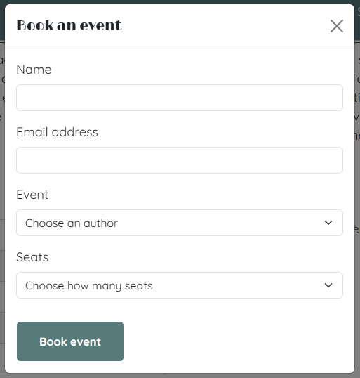
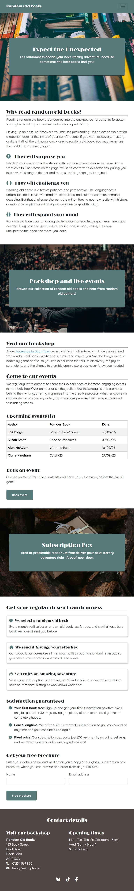
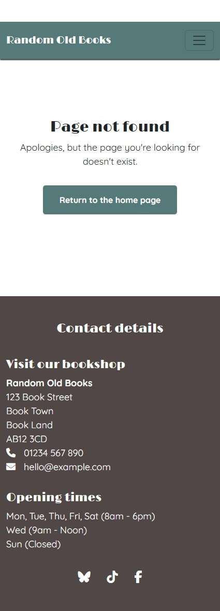
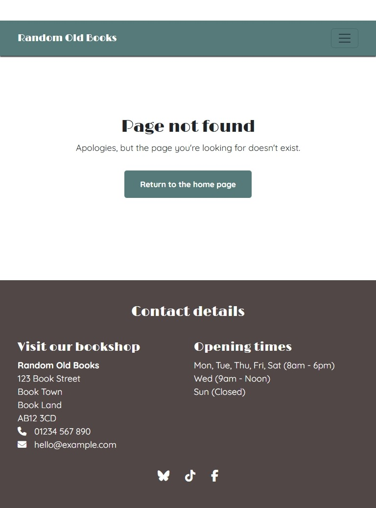
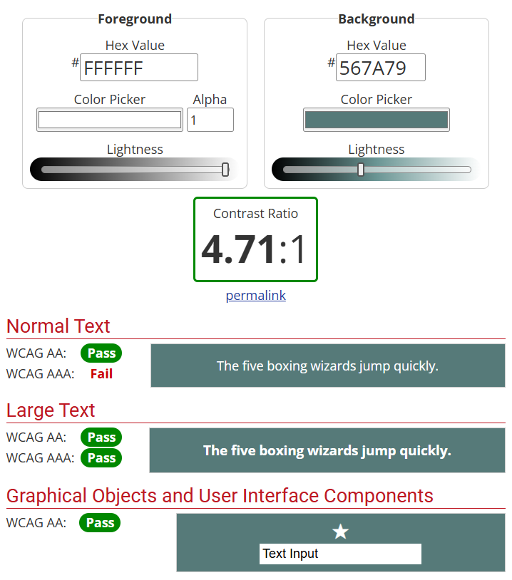

# Random Old Books - Manual Testing

## Functionality

### Links

#### Homepage links

|Feature|Expect|Action|Result|
|---|---|---|---|
|Navbar Logo link|When clicked, the page scrolls to the top|Clicked the logo when the page was scrolled to the bottom|The page scrolled to the top|
|Navbar "Shop & Events" link|When clicked, the page scrolls to the bookshop and events header|Clicked the link  when the page was at the top|The page scrolled to the bookshop and events header|
|Navbar "Subscription Box" link|When clicked, the page scrolls to the subscription box header|Clicked the link when the page was at the top|The page scrolled to the subscription box header|
|Navbar "Contact" link|When clicked, the page scrolls to the footer's contact details section|Clicked the link when the page was at the top|The page scrolled to the footer's contact details section|
|Bookshop and events section "bookshop in Book Town" link|When clicked, the page scrolls to the footer's contact details section|Clicked the link|The page scrolled to the footer's contact details section|
|Footer social media icon: Bluesky|When clicked, the Bluesky homepage opens in a new tab|Clicked the icon|The Bluesky homepage opened in a new tab|
|Footer social media icon: TikTok|When clicked, the TikTok homepage opens in a new tab|Clicked the icon|The TikTok homepage opened in a new tab|
|Footer social media icon: Facebook|When clicked, the Facebook homepage opens in a new tab|Clicked the icon|The Facebook homepage opened in a new tab|

#### Form Success page links

|Feature|Expect|Action|Result|
|---|---|---|---|
|Navbar Logo link|When clicked, the homepage opens|Clicked the logo|The homepage opened|
|Navbar "Shop & Events" link|When clicked, the homepage opens and scrolls to the bookshop and events header|Clicked the link|The homepage opened and scrolled to the bookshop and events header|
|Navbar "Subscription Box" link|When clicked, the homepage opens and scrolls to the subscription box header|Clicked the link|The homepage opened and scrolled to the subscription box header|
|Navbar "Contact" link|When clicked, the homepage opens and scrolls to the footer's contact details section|Clicked the link|The homepage opened and scrolled to the footer's contact details section|
|"Return to the homepage" button|When clicked, the homepage opens|Clicked the button|The homepage opened|
|Footer social media icon: Bluesky|When clicked, the Bluesky homepage opens in a new tab|Clicked the icon|The Bluesky homepage opened in a new tab|
|Footer social media icon: TikTok|When clicked, the TikTok homepage opens in a new tab|Clicked the icon|The TikTok homepage opened in a new tab|
|Footer social media icon: Facebook|When clicked, the Facebook homepage opens in a new tab|Clicked the icon|The Facebook homepage opened in a new tab|

#### 404 Error page links

|Feature|Expect|Action|Result|
|---|---|---|---|
|Navbar Logo link|When clicked, the homepage opens|Clicked the logo|The homepage opened|
|Navbar "Shop & Events" link|When clicked, the homepage opens and scrolls to the bookshop and events header|Clicked the link|The homepage opened and scrolled to the bookshop and events header|
|Navbar "Subscription Box" link|When clicked, the homepage opens and scrolls to the subscription box header|Clicked the link|The homepage opened and scrolled to the subscription box header|
|Navbar "Contact" link|When clicked, the homepage opens and scrolls to the footer's contact details section|Clicked the link|The homepage opened and scrolled to the footer's contact details section|
|"Return to the homepage" button|When clicked, the homepage opens|Clicked the button|The homepage opened|
|Footer social media icon: Bluesky|When clicked, the Bluesky homepage opens in a new tab|Clicked the icon|The Bluesky homepage opened in a new tab|
|Footer social media icon: TikTok|When clicked, the TikTok homepage opens in a new tab|Clicked the icon|The TikTok homepage opened in a new tab|
|Footer social media icon: Facebook|When clicked, the Facebook homepage opens in a new tab|Clicked the icon|The Facebook homepage opened in a new tab|

### Forms

#### Event modal form

|Feature|Expect|Action|Result|Image|
|---|---|---|---|---|
|Bookshop and Events section "Book event" button|When clicked, the modal Event form opens|Clicked the button|The modal Event form opened| |
|Name validation|An error message is displayed if the form is submitted when Name is empty|Submitted the form when Name was empty|An error message was displayed| |
|Empty Email Address validation|An error message is displayed if the form is submitted when Email Address is empty|Submitted the form when Email Address was empty|An error message was displayed| |
|Invalid Email Address validation|An error message is displayed if the form is submitted with an invalid Email Address|Submitted the form with an invalid Email Address|An error message was displayed| |
|Event validation|An error message is displayed if the form is submitted with no Event selected|Submitted the form with no Event selected|An error message was displayed| |
|Seats validation|An error message is displayed if the form is submitted with no Seats selected|Submitted the form with no Seats selected|An error message was displayed| |
|Redirection after successful submission|When the form is successfully submitted, the Form Success page is loaded with the form's input values in the URL|Submitted the form|The Form Success page was loaded with the input values shown in the URL| |

#### Subscription Box form
|Feature|Expect|Action|Result|Image|
|---|---|---|---|---|
|Name validation|An error message is displayed if the form is submitted when Name is empty|Submitted the form when Name was empty|An error message was displayed| |
|Empty Email Address validation|An error message is displayed if the form is submitted when Email Address is empty|Submitted the form when Email Address was empty|An error message was displayed| |
|Invalid Email Address validation|An error message is displayed if the form is submitted with an invalid Email Address|Submitted the form with an invalid Email Address|An error message was displayed| |
|Redirection after successful submission|When the form is successfully submitted, the Form Success page is loaded with the form's input values in the URL|Submitted the form|The Form Success page was loaded with the input values shown in the URL| |

### 404 errors (page not found)

|Feature|Expect|Action|Result|
|---|---|---|---|
|Bespoke 404 error page|When the user tries to navigate to a missing page, the bespoke 404 error page opens|Visited a URL that doesn't exist on the site|The 404 error page opened|

## Responsiveness

All pages respond as expected across mobile, tablet and desktop screens.

|Page | Mobile | Tablet | Desktop |
|---|---|---|---|
|index.html responds as expected?|Yes|Yes|Yes|
|form-success.html responds as expected?|Yes|Yes|Yes|
|404.html responds as expected?|Yes|Yes|Yes|

### Homepage mobile screenshot

### Homepage tablet screenshot

### Homepage desktop screenshot

### Form Success page mobile screenshot

### Form Success page tablet screenshot

### Form Success page desktop screenshot

### 404 Error page mobile screenshot

### 404 Error page tablet screenshot

### 404 Error page desktop screenshot

## Browser tests

The site's functionality and responsiveness was tested on Edge, Chrome and Firefox, as these are some of the most popular browsers. The tests shown in the sections above were all carried out on Edge. Identical tests were carried out on Chrome and Firefox, with the results summarised in the table below.

|Test|Edge|Chrome|Firefox|
|---|---|---|---|
|index.html functionality as expected?|Yes|Yes|Yes|
|index.html responsiveness as expected? |Yes|Yes|Yes|
|form-success.html functionality as expected?|Yes|Yes|Yes|
|form-success.html responsiveness as expected? |Yes|Yes|Yes|
|404.html functionality as expected?|Yes|Yes|Yes|
|404.html responsiveness as expected? |Yes|Yes|Yes|

All of the functionality and responsiveness screenshots above were taken on Edge, so I've included a few additional screenshots of the testing process on Chrome and Firefox below. 

### Homepage at tablet width on Chrome

### Event form validation at tablet width on Chrome

### Form Success page at desktop width on Firefox

### 404 Error page at desktop width on Firefox

## Code validation

### HTML validation

HTML validation was carried out using the [W3 HTML Validator](https://validator.w3.org/).

#### index.html

*Error: Header must not appear as a descendant of the footer (fixed)*
- The footer contained a header element. 
- I fixed this by removing the header element.

*Error: The for attribute of the label element must be the ID of a non-hidden form control (fixed)*
- On the events form, the "event" and "seats" inputs didn't have ID attributes. 
- To fix this, I gave them the same ID as their name attributes.

*Error: Duplicate ID (fixed)*
- The events and subscription box forms both had inputs with IDs "name" and "email". - To fix this, I gave them IDs using prefixes "events" and "subscription-box".

*Warning: Section lacks heading (fixed)*
- Some sections didn't have a heading as a direct descendent. 
- I fixed this by changing these section elements to divs.

*Info: Trailing slash on void elements (not fixed)*
- Trailing slashes are inserted by the Prettier formatting extension that I used in VS Code. Given that the point of using an opinionated auto-formatter is to standardise formatting and avoid formatting arguments, I decided to leave these trailing slashes in place, even though they are not considered best practice.

#### form-success.html

*Error: Header must not appear as a descendant of the footer (fixed)*
- The footer contained a header element. 
- To fix this, I removed the header element.

*Warning: Section lacks heading (fixed)*
- The social media section lacked a heading. 
- To fix this, I converted the section into a div as it didn't have enough content to warrant being a section.

*Info: Trailing slash on void elements (not fixed)*
- Trailing slashes are inserted by the Prettier formatting extension that I used in VS Code. Given that the point of using an opinionated auto-formatter is to standardise formatting and avoid formatting arguments, I decided to leave these trailing slashes in place, even though they are not considered best practice.

#### 404.html

*Info: Trailing slash on void elements (not fixed)*
- Trailing slashes are inserted by the Prettier formatting extension that I used in VS Code. Given that the point of using an opinionated auto-formatter is to standardise formatting and avoid formatting arguments, I decided to leave these trailing slashes in place, even though they are not considered best practice.

### CSS Validation

CSS validation was carried out using the [W3 CSS Validator](https://jigsaw.w3.org/css-validator/).

#### styles.css

*Errors: None*

*Warnings: 3*
  - There were warnings about CSS variables not being statically checked. As the CSS variables have effectively been tested by the site's functional and visual tests, these warnings were ignored.

### Javascript validation

Javascript validation was carried out using [JS Hint](https://jshint.com/).

#### script.js

*Warnings or errors: None*

## Contrast checker

Contrast strength was checked using the [WebAim Contrast Checker](https://webaim.org/resources/contrastchecker/).

### Contrast between #FFFFFF (white) text on #567A79 (green) background

All tests passed at AA level.

### Contrast between #FFFFFF (white) text on #504746 (brown) background

All tests passed at AA and AAA levels.

## Lighthouse

Each page was tested with Lighthouse, using Mobile and Desktop settings.

|Page|Device|Result|
|---|---|---|
|index.html|Mobile|  |
|index.html|Desktop|  |
|form-success.html|Mobile|  |
|form-success.html|Desktop|  |
|404.html|Mobile|  |
|404.html|Desktop|  |

## Unfixed bugs

There are no remaining bugs that I am aware of. Having said that, even after thorough testing I cannot completely rule out the possibility of some hidden bugs.
